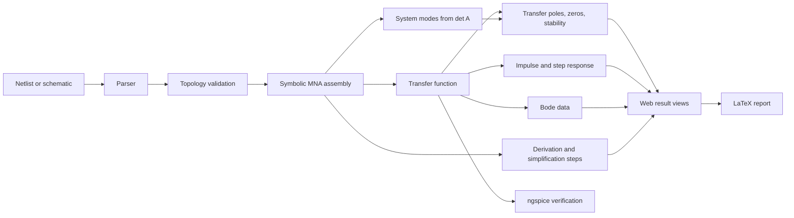

<div align="center">

# CircuitSage

### Symbolic circuit analysis, from netlist to derivation

CircuitSage analyzes linear RLC circuits with **symbolic Modified Nodal Analysis (MNA)** and presents the full result as equations, plots, derivation steps, and an optional LaTeX report.

[](https://github.com/BJDG-CM/CircuitSage/actions/workflows/ci.yml)


</div>

## Overview

Most circuit simulators focus on numerical waveforms. CircuitSage keeps the circuit symbolic for as long as possible, so it can show not only the answer, but also how the answer was constructed.

Given a SPICE-like netlist, CircuitSage can:

- assemble the symbolic MNA system \(A(s)x=z(s)\)
- derive the transfer function \(H(s)=V_o(s)/V_i(s)\)
- calculate transfer poles and zeros, **plus internal system modes derived
  independently from \(\det A(s)\)** — a mode cancelled in H(s) is still reported
- judge transfer stability and internal stability separately (Routh–Hurwitz or numeric)
- obtain impulse and step responses in closed form where one exists
- generate exact and asymptotic Bode data
- handle capacitor and inductor initial conditions
- record element stamps and circuit-reduction steps
- export a lecture-note-style LaTeX report
- optionally cross-check results against ngspice (when installed)

CircuitSage is **local-first**: analysis runs entirely on your machine with no
external service. The same app can optionally be exposed as a restricted public
demo (see [Operating profiles](#operating-profiles-and-safety)).

The project is designed as both an **educational circuit-analysis tool** and a **verifiable symbolic computation system**.

## Highlights

| Area | Capability |
|---|---|
| Symbolic engine | Exact arithmetic with SymPy, symbolic component values, MNA stamp assembly |
| Dynamics | Initial-condition equivalents, zero-state/zero-input decomposition, inverse Laplace transform |
| Stability | Transfer poles vs. internal system modes, Routh–Hurwitz analysis including zero-pivot and zero-row cases |
| Topology | Ground and floating-node checks, source-loop/cut-set detection, planarity analysis |
| Visualization | Interactive time-response and Bode plots with asymptotic magnitude curves |
| Explanation | Per-component stamp deltas, MNA checkpoints, series/parallel/source transformations |
| Verification | AC and transient comparison against ngspice with numerical error reports |
| Interface | Netlist editor, SVG schematic editor, example library, shareable circuit links |

## Example

```spice
* Symbolic RC low-pass filter
Vin  in   0    Vi
R1   in   out  R
C1   out 0    C
.out V(out) Vin
.end
```

CircuitSage derives:

\[
H(s)=\frac{1}{1+sRC},
\qquad
p=-\frac{1}{RC}
\]

\[
h(t)=\frac{1}{RC}e^{-t/(RC)},
\qquad
y_{\mathrm{step}}(t)=1-e^{-t/(RC)},\quad t\ge0
\]

Numeric substitutions such as `R=1000, C=1e-6` can then be applied to produce plots and ngspice verification results without changing the symbolic netlist.

## Quick Start

### Docker

The Docker image contains the frontend, API, symbolic engine, and ngspice.

```bash
docker build -f docker/Dockerfile -t circuitsage .
docker run --rm -p 127.0.0.1:8000:8000 -v circuitsage-data:/data circuitsage
```

Open **http://localhost:8000**. The `127.0.0.1` binding keeps the container
local-only; expose it deliberately (ideally with `CIRCUITSAGE_MODE=public-demo`)
if you want it reachable from elsewhere. Shared circuits persist in the
`circuitsage-data` volume, and `/api/health` backs the container health check.

### Local Development

Requirements:

- Python 3.10+
- Node.js 22+
- ngspice in `PATH` for optional numerical verification

```bash
# Python environment
python -m venv .venv
source .venv/bin/activate
# Windows PowerShell: .\.venv\Scripts\Activate.ps1

python -m pip install -e "core[dev]" -e "api[dev]"
python -m uvicorn circuitsage_api.main:app --reload --port 8000
```

In another terminal:

```bash
cd web
npm ci
npm run dev
```

Open **http://localhost:5173**.

Helper scripts automate the checks above (they verify Python/Node and warn —
without failing — when ngspice is absent):

```bash
./scripts/dev.sh          # Unix: dependency checks, then API + Vite
.\scripts\dev.ps1         # Windows PowerShell equivalent
python scripts/launch.py  # start backend on 127.0.0.1, wait for /api/health,
                          # open the browser, clean shutdown on Ctrl+C
```

## Netlist Syntax

CircuitSage implements a focused SPICE subset with symbolic-analysis extensions.

```spice
* RLC circuit with initial conditions
Vin  in   0    Vi
R1   in   n1   R
L1   n1   out  2m  IC=0.1
C1   out  0    C   IC=5
.out V(out) Vin
.end
```

| Syntax | Description |
|---|---|
| `Rname n+ n- value` | Resistor |
| `Lname n+ n- value [IC=i0]` | Inductor with optional initial current |
| `Cname n+ n- value [IC=v0]` | Capacitor with optional initial voltage |
| `Vname n+ n- value` | Independent voltage source |
| `Iname n+ n- value` | Independent current source |
| `.out V(node) source` | Defines \(H(s)=V(node)/source\) |
| `k m u n p Meg` | Supported SPICE scale suffixes |

A numeric value is stored exactly whenever possible. An identifier such as `R`, `C`, or `Vi` is interpreted as a symbolic parameter.

## Analysis Pipeline



The dependency direction is intentionally one-way:

```text
web  →  api  →  core
```

The `core` package has no web-framework dependency and can be used independently in tests, scripts, or notebooks.

## Web Interface

The application provides two input modes:

- **Netlist editor** — direct SPICE-like text input with example circuits
- **Schematic editor** — SVG-based component placement compiled into the same netlist pipeline

Analysis results are organized into seven views:

1. Summary
2. MNA derivation
3. Time response
4. Bode plot
5. Circuit simplification
6. LaTeX report
7. ngspice verification

Circuits can also be stored as shareable links through the SQLite-backed share API.

## API

### Solve a circuit

```http
POST /api/solve
Content-Type: application/json
```

```json
{
  "netlist": "Vin in 0 Vi\nR1 in out R\nC1 out 0 C\n.out V(out) Vin\n",
  "options": {
    "numeric_values": {
      "R": 1000,
      "C": 0.000001,
      "Vi": 1
    },
    "responses": ["impulse", "step"],
    "verify": true,
    "latex": true
  }
}
```

The response can include:

- topology, planarity, and a complexity report (component/node/symbol counts, MNA dimension)
- MNA matrices, unknowns, stamps, and checkpoints
- transfer function with its reduced denominator, transfer poles and zeros
- `transfer_stability` (from the reduced H(s) denominator) and `system_modes`
  (internal modes from \(\det A(s)\), including modes cancelled in H(s), with
  their own `internal_stability` verdict and a status of `ok`/`static`/`partial`/`unknown`)
- impulse and step responses with sampled data
- Bode magnitude, phase, corner frequencies, and asymptotes
- circuit-simplification steps
- ngspice verification with status `ok`/`error`/`unavailable` and error reports
- generated LaTeX source
- solver diagnostics (backend, stage timings) when `options.debug` is set

Additional endpoints:

| Method | Endpoint | Purpose |
|---|---|---|
| `GET` | `/api/examples` | List bundled example circuits |
| `POST` | `/api/share` | Create a shareable circuit record |
| `GET` | `/api/share/{id}` | Restore a shared circuit |

## Verification and Testing

CircuitSage uses three complementary validation layers:

```text
hand-derived theory
        ==
symbolic engine result
        ≈
ngspice numerical result
```

The test suite covers:

- hand-derived golden circuits
- MNA stamps and source conventions
- initial-condition equivalents and superposition
- Routh–Hurwitz special cases
- repeated and complex poles in inverse Laplace transforms
- Bode landmarks and asymptotic slopes
- topology errors and non-planar networks
- property-based resistor-ladder generation with Hypothesis
- AC and transient ngspice comparison
- API error mapping and share links
- schematic-to-netlist compilation
- production frontend and Docker builds in CI

Run the checks locally:

```bash
python -m pytest core/tests api/tests

cd web
npm run lint
npm test
npm run build
```

## Project Structure

```text
CircuitSage/
├── core/                  # Symbolic analysis package
│   ├── circuitsolver/
│   │   ├── parser.py      # Netlist parser
│   │   ├── graph.py       # Topology and planarity checks
│   │   ├── mna.py         # Symbolic MNA stamps and assembly
│   │   ├── initial.py     # Initial-condition transformations
│   │   ├── analysis.py    # H(s), poles, zeros, and stability
│   │   ├── laplace.py     # Table-driven inverse Laplace transform
│   │   ├── bode.py        # Frequency-response data
│   │   ├── simplify.py    # Step-by-step circuit reduction
│   │   ├── report.py      # LaTeX report generation
│   │   └── verify.py      # ngspice cross-verification
│   └── tests/
├── api/                   # FastAPI application
├── web/                   # React + TypeScript frontend
├── examples/              # Bundled circuit netlists
├── docker/                # Production container
└── .github/workflows/     # CI pipeline
```

## Current Scope

CircuitSage currently targets small **linear, lumped, time-invariant circuits** composed of:

- resistors
- inductors
- capacitors
- independent voltage sources
- independent current sources

**Not supported:** dependent sources (VCVS/VCCS/CCCS/CCVS), operational
amplifiers, coupled inductors / transformers, transmission lines, switches, and
all nonlinear devices (diodes, transistors). Unsupported elements are rejected
at parse time with the offending line number.

CircuitSage is intended for symbolic analysis, education, and verification. It
is not a replacement for a full industrial SPICE simulator or a nonlinear
device simulator.

### Performance expectations

Symbolic solving cost is driven mainly by the number of *independent symbolic
parameters*, not by component count, and it grows quickly — see
[docs/benchmarks.md](docs/benchmarks.md) for measured numbers and how the
solver backend is chosen. There is no guarantee that an arbitrary circuit can
be solved symbolically in reasonable time; that is why every solve runs behind
a killable worker process with a hard timeout and preflight complexity limits.

## Operating profiles and safety

`CIRCUITSAGE_MODE` selects one of two profiles:

| | `local` (default) | `public-demo` |
|---|---|---|
| Intent | Trusted single user on localhost | Restricted shared demo, single instance |
| Complexity limits | Generous, each configurable, `0` disables | Strict (12 components, 24×24 MNA, 6 symbols, 10 kB netlist) |
| Solve timeout | 30 s default; `0` runs in-process without isolation | Mandatory, clamped to 1–120 s |
| Rate limiting | Off | 20 solve requests/min per client IP |
| Share records | No TTL, unbounded | 20 kB payload cap, 7-day TTL, 2 000-row retention with request-triggered cleanup |
| Errors | Structured codes, no tracebacks | Same, never leaks tracebacks |

Every solve executes in a separate worker process that is killed on timeout —
SymPy computations cannot be interrupted any other way. The rate limiter is an
in-memory, single-instance mechanism: it resets on restart and is not shared
across replicas, which is appropriate for a personal deployment and nothing more.

## Configuration

| Environment variable | Default (`local` / `public-demo`) | Description |
|---|---|---|
| `CIRCUITSAGE_MODE` | `local` | Operating profile (`local` \| `public-demo`) |
| `CIRCUITSAGE_SOLVE_TIMEOUT_SECONDS` | `30` / forced ≥ 1 | Hard worker-process timeout; `0` = in-process trusted mode (local only) |
| `CIRCUITSAGE_MAX_COMPONENTS` | `15` / `12` | Component-count limit (`0` disables, local only) |
| `CIRCUITSAGE_MAX_MNA_DIMENSION` | `40` / `24` | MNA matrix dimension limit |
| `CIRCUITSAGE_MAX_SYMBOLS` | `16` / `6` | Independent symbolic-parameter limit |
| `CIRCUITSAGE_MAX_NETLIST_BYTES` | `200000` / `10000` | Netlist size limit (checked before parsing) |
| `CIRCUITSAGE_RATE_LIMIT_PER_MINUTE` | off / `20` | Per-IP solve rate limit (single-instance, in-memory) |
| `CIRCUITSAGE_SOLVER` | `auto` | Solve backend override (`auto` \| `lusolve` \| `cramer`) |
| `CIRCUITSAGE_NGSPICE_TIMEOUT_SECONDS` | `60` | ngspice subprocess timeout |
| `CIRCUITSAGE_SHARE_MAX_BYTES` | `200000` / `20000` | Share payload size cap |
| `CIRCUITSAGE_SHARE_TTL_SECONDS` | off / `604800` | Share-record expiration |
| `CIRCUITSAGE_SHARE_MAX_ROWS` | off / `2000` | Bounded share retention (oldest deleted first) |
| `CIRCUITSAGE_CORS_ORIGINS` | dev origin / unset | Extra allowed CORS origins (comma-separated) |
| `CIRCUITSAGE_EXAMPLES_DIR` | `./examples` | Directory containing bundled `.cir` files |
| `CIRCUITSAGE_DB` | `./circuitsage.db` | SQLite path for shared circuits |
| `CIRCUITSAGE_STATIC_DIR` | unset | Built frontend directory served by FastAPI |

## Design Documentation

The detailed architecture, mathematical decisions, milestones, and design records are documented in:

**[Symbolic Circuit Solver — Design Document](Symbolic-Circuit-Solver-설계문서.md)**

